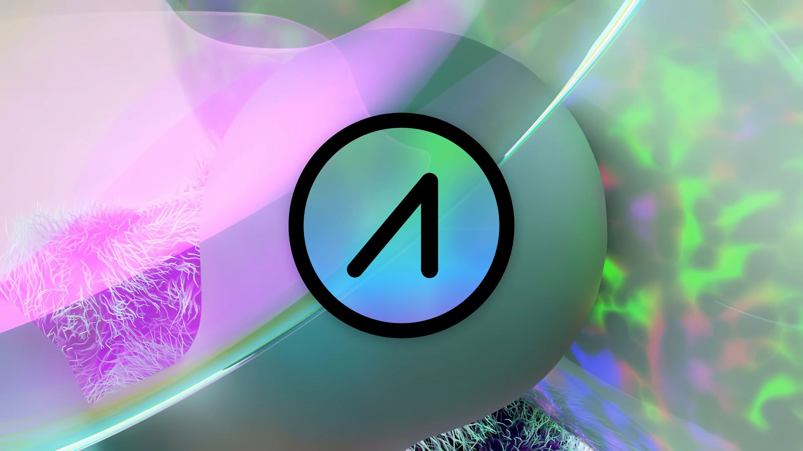

# AIOZ Network

AIOZ Network is an Infrastructure Web3 Media Blockchain.

AIOZ Network is a Layer-1 Interoperable Blockchain compatible with Ethereum Virtual Machine Smart Contracts built on Solidity. It works with the Inter-Blockchain Communication (IBC) protocol, allowing it to connect to and exchange data and more with other COSMOS-based blockchains.

As a Web3 Peer-to-Peer Nodes-Powered Distributed Decentralized Content Delivery Network (dCDN), AIOZ Network rewards Edge Nodes’ computational resources for storing, transcoding, and streaming digital media content.

## Quick Start

To get started with AIOZ Network, follow these simple steps:

- Download the latest [release](RELEASES.md).
- Follow the instructions in this [guide](https://docs.aioz.network/aioz-tutorials/join-mainnet.html) to learn how to join the AIOZ Network mainnet.

## Talk to us!

We have active, helpful communities on Twitter and Telegram.

- [Telegram](https://t.me/aioznetwork)
- [Twitter](https://twitter.com/AIOZNetwork)
